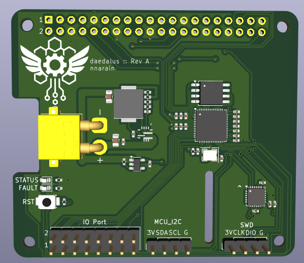

Daedalus is a Raspberry Pi add-on that aims to supply the necessary components for common robotics applications such as power distribution, IO, sensors and software defined embedded logic.

Features:

* Switch mode power supply (7V - 25V input, 5V @ 6A output)
* 3.3V linear regulator
* On board RP2040 co-processor
* MPU-6050 IMU
* 16 GPIO (8x Pi + 8x MCU)